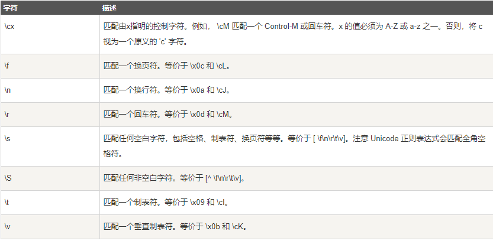
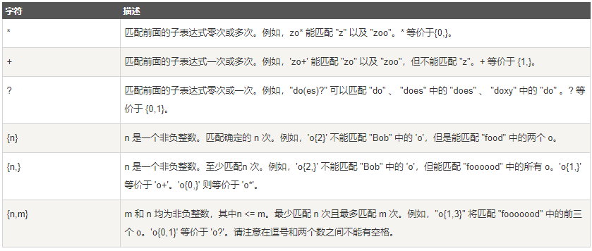
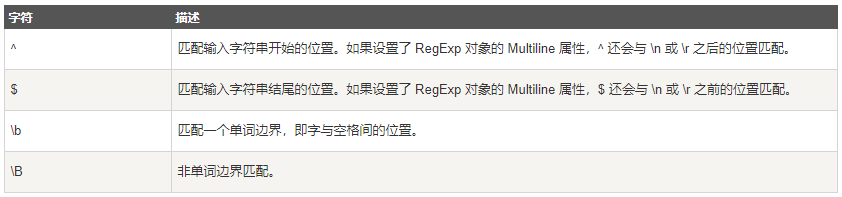

# NLP

## RE

### [语法](<https://www.runoob.com/regexp/regexp-syntax.html>)

#### 非打印字符



#### 特殊字符


#### 限定符



#### 定位符



### re.match

> re.match 尝试从字符串的起始位置匹配一个模式，如果不是起始位置匹配成功的话，match()就返回none。

#### 常规匹配

```python
import re

content = 'Hello 123 4567 World_This is a Regex Demo'
result = re.match('^Hello\s\d\d\d\s\d{4}\s\w{10}.*Demo$', content)

print(result)
print(result.group())
print(result.span())

# <_sre.SRE_Match object; span=(0, 41), match='Hello 123 4567 World_This is a Regex Demo'>
# Hello 123 4567 World_This is a Regex Demo
# (0, 41)
```

#### 泛匹配

```python
import re

content = 'Hello 123 4567 World_This is a Regex Demo'
result = re.match('^Hello.*Demo$', content)

print(result)
print(result.group())
print(result.span)

# <_sre.SRE_Match object; span=(0, 41), match='Hello 123 4567 World_This is a Regex Demo'>
# Hello 123 4567 World_This is a Regex Demo
# (0, 41)
```

#### 目标匹配

```python
import re

content = 'Hello 1234567 World_This is a Regex Demo'
result = re.match('^Hello\s(\d+)\sWorld.*Demo$', content)

print(result)
print(result.group(1))
print(result.span())

# <_sre.SRE_Match object; span=(0, 40), match='Hello 1234567 World_This is a Regex Demo'>
# 1234567
# (0, 40)
```

#### 贪婪匹配

```python
import re

content = 'Hello 1234567 World_This is a Regex Demo'
result = re.match('^He.*(\d+).*Demo$', content)


print(result.group(1))

# 7
```

#### 非贪婪匹配

```python
import re

content = 'Hello 1234567 World_This is a Regex Demo'
result = re.match('^He.*?(\d+).*Demo$', content)

print(result.group(1))

# 1234567
```

#### 匹配模式

```python
import re

content = '''Hello 1234567 World_This
is a Regex Demo
'''

result = re.match('^He.*?(\d+).*?Demo$', content, re.S)

print(result.group(1))

# 1234567
```

### re.search

> re.search 扫描整个字符串并返回第一个成功的匹配。

```python
import re

content = 'Extra stings Hello 1234567 World_This is a Regex Demo Extra stings'
result = re.search('Hello.*?(\d+).*?Demo', content)

print(result.group(1))

# 1234567
```


> 总结：为匹配方便，能用search就不用match

```python
import re

html = '''<div id="songs-list">
    <h2 class="title">经典老歌</h2>
    <p class="introduction">
        经典老歌列表
    </p>
    <ul id="list" class="list-group">
        <li data-view="2">一路上有你</li>
        <li data-view="7">
            <a href="/2.mp3" singer="任贤齐">沧海一声笑</a>
        </li>
        <li data-view="4" class="active">
            <a href="/3.mp3" singer="齐秦">往事随风</a>
        </li>
        <li data-view="6"><a href="/4.mp3" singer="beyond">光辉岁月</a></li>
        <li data-view="5"><a href="/5.mp3" singer="陈慧琳">记事本</a></li>
        <li data-view="5">
            <a href="/6.mp3" singer="邓丽君"><i class="fa fa-user"></i>但愿人长久</a>
        </li>
    </ul>
</div>'''

result = re.search('<li.*?active.*?singer="(.*?)">(.*?)</a>', html, re.S)

if result:
    print(result.group(1), result.group(2))

# 齐秦 往事随风
```

```python

result = re.search('<li.*?singer="(.*?)">(.*?)</a>', html, re.S)

if result:
    print(result.group(1), result.group(2))
    
# 任贤齐 沧海一声笑
```

```python
result = re.search('<li.*?singer="(.*?)">(.*?)</a>', html)
if result:
    print(result.group(1), result.group(2))
    
# beyond 光辉岁月
```

### re.findall

> 搜索字符串，以列表形式返回全部能匹配的子串。

```python
import re

html = '''<div id="songs-list">
    <h2 class="title">经典老歌</h2>
    <p class="introduction">
        经典老歌列表
    </p>
    <ul id="list" class="list-group">
        <li data-view="2">一路上有你</li>
        <li data-view="7">
            <a href="/2.mp3" singer="任贤齐">沧海一声笑</a>
        </li>
        <li data-view="4" class="active">
            <a href="/3.mp3" singer="齐秦">往事随风</a>
        </li>
        <li data-view="6"><a href="/4.mp3" singer="beyond">光辉岁月</a></li>
        <li data-view="5"><a href="/5.mp3" singer="陈慧琳">记事本</a></li>
        <li data-view="5">
            <a href="/6.mp3" singer="邓丽君">但愿人长久</a>
        </li>
    </ul>
</div>'''

results = re.findall('<li.*?href="(.*?)".*?singer="(.*?)">(.*?)</a>', html, re.S)

print(type(results))

for result in results:
    print(result)
    print(result[0], result[1], result[2])
    
# <class 'list'>
# ('/2.mp3', '任贤齐', '沧海一声笑')
# /2.mp3 任贤齐 沧海一声笑
# ('/3.mp3', '齐秦', '往事随风')
# /3.mp3 齐秦 往事随风
# ('/4.mp3', 'beyond', '光辉岁月')
# /4.mp3 beyond 光辉岁月
# ('/5.mp3', '陈慧琳', '记事本')
# /5.mp3 陈慧琳 记事本
# ('/6.mp3', '邓丽君', '但愿人长久')
# /6.mp3 邓丽君 但愿人长久
```

```python
import re

html = '''<div id="songs-list">
    <h2 class="title">经典老歌</h2>
    <p class="introduction">
        经典老歌列表
    </p>
    <ul id="list" class="list-group">
        <li data-view="2">一路上有你</li>
        <li data-view="7">
            <a href="/2.mp3" singer="任贤齐">沧海一声笑</a>
        </li>
        <li data-view="4" class="active">
            <a href="/3.mp3" singer="齐秦">往事随风</a>
        </li>
        <li data-view="6"><a href="/4.mp3" singer="beyond">光辉岁月</a></li>
        <li data-view="5"><a href="/5.mp3" singer="陈慧琳">记事本</a></li>
        <li data-view="5">
            <a href="/6.mp3" singer="邓丽君">但愿人长久</a>
        </li>
    </ul>
</div>'''

results = re.findall('<li.*?>\s*?(<a.*?>)?(\w+)(</a>)?\s*?</li>', html, re.S)

for result in results:
    print(result[1])

# 一路上有你
# 沧海一声笑
# 往事随风
# 光辉岁月
# 记事本
# 但愿人长久
```

### re.sub

> 替换字符串中每一个匹配的子串后返回替换后的字符串。

```python
import re

content = 'Extra stings Hello 1234567 World_This is a Regex Demo Extra stings'
content = re.sub('\d+', '', content)

print(content)

# Extra stings Hello  World_This is a Regex Demo Extra stings
```

```python
import re

content = 'Extra stings Hello 1234567 World_This is a Regex Demo Extra stings'
content = re.sub('\d+', 'Replacement', content)

print(content)

# Extra stings Hello Replacement World_This is a Regex Demo Extra stings
```

```python
import re

content = 'Extra stings Hello 1234567 World_This is a Regex Demo Extra stings'
content = re.sub('(\d+)', r'\1 8910', content)

print(content)

# Extra stings Hello 1234567 8910 World_This is a Regex Demo Extra stings
```

```python
import re

html = '''<div id="songs-list">
    <h2 class="title">经典老歌</h2>
    <p class="introduction">
        经典老歌列表
    </p>
    <ul id="list" class="list-group">
        <li data-view="2">一路上有你</li>
        <li data-view="7">
            <a href="/2.mp3" singer="任贤齐">沧海一声笑</a>
        </li>
        <li data-view="4" class="active">
            <a href="/3.mp3" singer="齐秦">往事随风</a>
        </li>
        <li data-view="6"><a href="/4.mp3" singer="beyond">光辉岁月</a></li>
        <li data-view="5"><a href="/5.mp3" singer="陈慧琳">记事本</a></li>
        <li data-view="5">
            <a href="/6.mp3" singer="邓丽君">但愿人长久</a>
        </li>
    </ul>
</div>'''
html = re.sub('<a.*?>|</a>', '', html)

print(html)

results = re.findall('<li.*?>(.*?)</li>', html, re.S)

for result in results:
    print(result.strip())
    
# <div id="songs-list">
#     <h2 class="title">经典老歌</h2>
#     <p class="introduction">
#         经典老歌列表
#     </p>
#     <ul id="list" class="list-group">
#         <li data-view="2">一路上有你</li>
#         <li data-view="7">
#             沧海一声笑
#         </li>
#         <li data-view="4" class="active">
#             往事随风
#         </li>
#         <li data-view="6">光辉岁月</li>
#         <li data-view="5">记事本</li>
#         <li data-view="5">
#             但愿人长久
#         </li>
#     </ul>
# </div>
# 
# 一路上有你
# 沧海一声笑
# 往事随风
# 光辉岁月
# 记事本
# 但愿人长久
```

### re.compile

> 将正则字符串编译成正则表达式对象

```python
import re

content = '''Hello 1234567 World_This
is a Regex Demo'''

pattern = re.compile('Hello.*Demo', re.S)

print(pattern.match(content))

# <_sre.SRE_Match object; span=(0, 40), match='Hello 1234567 World_This\nis a Regex Demo'>
```

```python
import re

p = re.compile(r'\d+')

print(p.split('one1two2three'))

# ['one', 'two', 'three']
```

```python
import re

p = re.compile(r'\d+')

print(p.findall('one1two2three'))

# ['1', '2']
```

```python
import re

p = re.compile(r'(\w+) (\w+)')
s = 'hello world'
print(p.sub(r'\2 \1',s))

# world hello
```

```python
import re

p = re.compile(r'(\w+) (\w+)')
s = 'hello world'
print(p.subn(r'\2 \1', s))
```

## Jieba

> ​	和拉丁语系不同，亚洲语言是不用空格分开每个有意义的词的。而当我们进行自然语言处理的时候，大部分情况下，词汇是我们对句子和文章理解的基础，因此需要一个工具去把完整的文本中分解成粒度更细的词。
>
> ​	jieba就是这样一个非常好用的中文工具，是以分词起家的，但是功能比分词要强大很多。

### 1.基本分词函数与用法

jieba.cut 以及 jieba.cut_for_search 返回的结构都是一个可迭代的 generator，可以使用 for 循环来获得分词后得到的每一个词语(unicode)

**jieba.cut** 方法接受三个输入参数:

- 需要分词的字符串
- cut_all 参数用来控制是否采用全模式
- HMM 参数用来控制是否使用 HMM 模型

**jieba.cut_for_search** 方法接受两个参数

- 需要分词的字符串
- 是否使用 HMM 模型。

该方法适合用于搜索引擎构建倒排索引的分词，粒度比较细

```python
import jieba

seg_list = jieba.cut("我在学习自然语言处理", cut_all=True)

print("Full Mode: " + "/ ".join(seg_list))  # 全模式

seg_list = jieba.cut("我在学习自然语言处理", cut_all=False)
print("Default Mode: " + "/ ".join(seg_list))  # 精确模式

seg_list = jieba.cut("他毕业于上海交通大学，在百度深度学习研究院进行研究")  # 默认是精确模式
print(", ".join(seg_list))

seg_list = jieba.cut_for_search("小明硕士毕业于中国科学院计算所，后在哈佛大学深造")  # 搜索引擎模式
print(", ".join(seg_list))

# Full Mode: 我/ 在/ 学习/ 自然/ 自然语言/ 语言/ 处理
# Default Mode: 我/ 在/ 学习/ 自然语言/ 处理
# 他, 毕业, 于, 上海交通大学, ，, 在, 百度, 深度, 学习, 研究院, 进行, 研究
# 小明, 硕士, 毕业, 于, 中国, 科学, 学院, 科学院, 中国科学院, 计算, 计算所, ，, 后, 在, 哈佛, 大学, 哈佛大学, 深造
```